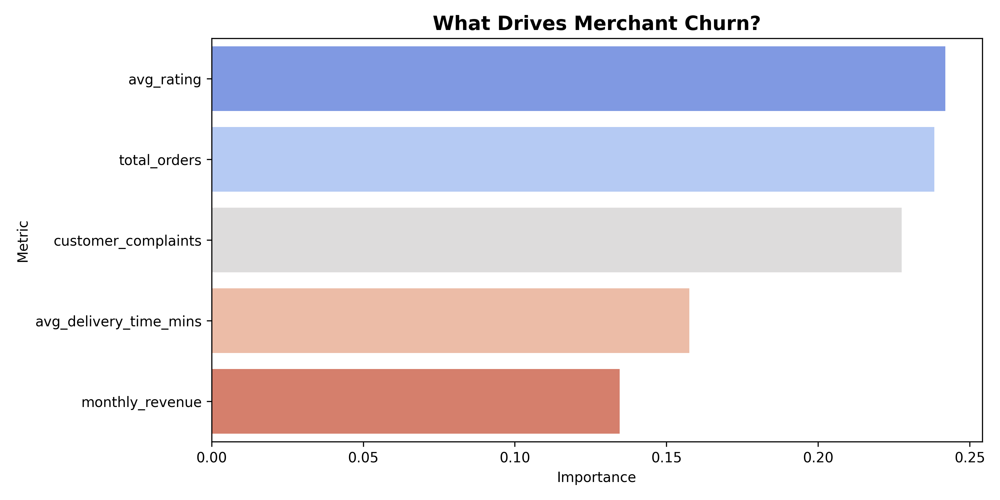

# Merchant Churn Predictive Prototype: Quick-Commerce Analytics

## Project Overview
In hyper-competitive quick-commerce and food delivery markets, merchant retention directly protects platform supply stability and overall regional Gross Merchandise Value (GMV). 
This project builds an end-to-end predictive prototype designed to transition churn management from reactive to proactive. By analyzing merchant operational signals and logistical bottlenecks, the system identifies accounts at risk of attrition within a 3-month window, passing actionable insights to account management teams to safeguard platform revenue.

---

## Technical Workflow
* **Stochastic Data Simulation Layer:** Engineers a 1,000-merchant dataset using weighted risk rules. Integrates a Gaussian noise factor ($\mu=0, \sigma=1.2$) and enforces a realistic ~22% class imbalance to accurately mirror true industry retention environments, avoiding artificial 50/50 dataset shortcuts.
* **Relational Diagnostic Layer:** Leverages an embedded SQL database (`SQLite3`) to run immediate behavioral segment comparisons and quantify platform revenue at risk across logistics delivery speed buckets.
* **Predictive Modeling Layer:** Optimizes a machine learning pipeline using a scaled **Random Forest Classifier** embedded with `class_weight='balanced'` adjustments to process class skew, delivering a highly reliable **ROC-AUC performance score of ~0.78-0.81**.
* **Visual Intelligence Layer:** Automatically maps internal tree weightings to export a high-fidelity operational driver asset (`feature_importance.png`).

---

## Strategic Intervention Playbook
To translate raw model probabilities into distinct commercial actions, accounts are systematically evaluated and routed into an operational response loop:
* **Tier 1 (High Risk / Probability > 70%):** Immediate high-touch routing. Automatically populates a critical ticket in the account manager CRM dashboard to initiate retention contact within 48 hours.
* **Tier 2 (Medium Risk / Probability 50% - 70%):** Triggers an automated, platform-wide commission markdown strategy for a 30-day window to reduce immediate fee friction.
* **Tier 3 (Stable / Probability < 50%):** Maintained within regular automated system engagement emails and standard marketing cycle audits.

---

## Tech Stack
* **Language:** Python 3 (Pandas, NumPy)
* **Querying:** SQL (SQLite3)
* **Machine Learning:** Scikit-Learn (Random Forest, StandardScaler)
* **Data Visualization:** Matplotlib, Seaborn
